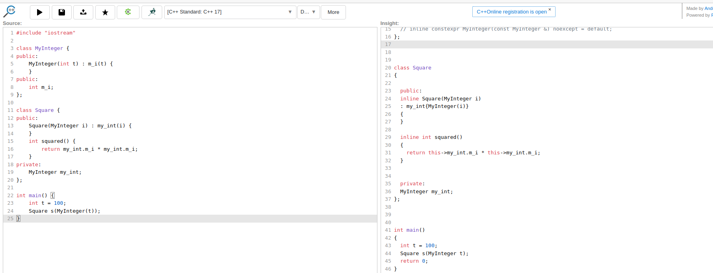

First Let me share the [wiki](https://en.wikipedia.org/wiki/Most_vexing_parse) and the [cpp reference](https://en.cppreference.com/w/cpp/language/direct_initialization)  (see notes section) 
which mentions this problem.

It is very important to note that this a not a error but a ambiguity due to historical reasons(pre C++11).Some times we need the ambiguity when we declare functions.

The Official Explanation :

In case of ambiguity between a variable declaration using the direct-initialization syntax (1) (with round parentheses) and a function declaration, the compiler always chooses function declaration. This disambiguation rule is sometimes counter-intuitive and has been called the most vexing parse.


Suppose we have a class foo. There are three ways post C++11 to create object of class foo

 foo obj;

 foo obj();  --> This is the cause of the ambiguity.

 foo obj{};

Function Declaration

A function declaration just introduces the function name and its type and some other optional specifiers.The Compiler will call the function
referencing a yet undefined symbol.
The Linker gets the translation units and resolves the mangled symbols by name.There can be multiple declarations of the same function(they must be exactly same) but there should
be one definition only (ODR).

Syntax of minimum function declaration 

return_type name( parameter list );

There can be other Optional parts of function declaration (i dont want to go into details here) like

constexpr ,(extern / static) , inline ,noexcept ,(const/volatile member functions) ,static (member functions ) and some other.

To keep the scope limited we just assume that the syntax of function declaration is return_type name( parameter list ); and now we try to create the ambiguity.

class foo { }

We create a function declaration that return a object of class foo and takes no arguments.

foo myfunction()

We create a object of class foo (remember the option 2 above)

foo myobj()

Now how will our compiler understand that we are creating a object or declaring a function. This is root of the problem.

Now we will try to explain with 2 real world looking examples.

First i need to explain a type decay rule in c++ .If a function object is declared as a paramter,

First let me quote straight from the c++ standard.

"The ambiguity arising from the similarity between a function-style cast and a declaration mentioned in 9.8
can also occur in the context of a declaration. In that context, the choice is between a function declaration
with a redundant set of parentheses around a parameter name and an object declaration with a function-style
cast as the initializer. Just as for the ambiguities mentioned in 9.8, the resolution is to consider any construct
that could possibly be a declaration a declaration. [ Note: A declaration can be explicitly disambiguated
by adding parentheses around the argument. "


```cpp
#include "iostream"

class MyInteger {
public:
    MyInteger(int t) : m_i(t) {
    }
public:
    int m_i;
};

class Square {
public:
    Square(MyInteger i) : my_int(i) {
    }
    int squared() {
        return my_int.m_i * my_int.m_i;
    }
private:
    MyInteger my_int;
};

int main() {
    int t = 100;
    Square s(MyInteger(t));
}
```

Here we have a class which takes a integer and is supposed to square it and return it.
But the line Square s(MyInteger(t)); declares a function named s which returns a Square and takes as input a paramter called 
t of type MyInteger.
So it is taking MyInteger(t) as a paramter of type t.This is due to the above rule in the standard.
But how can we prove this.



